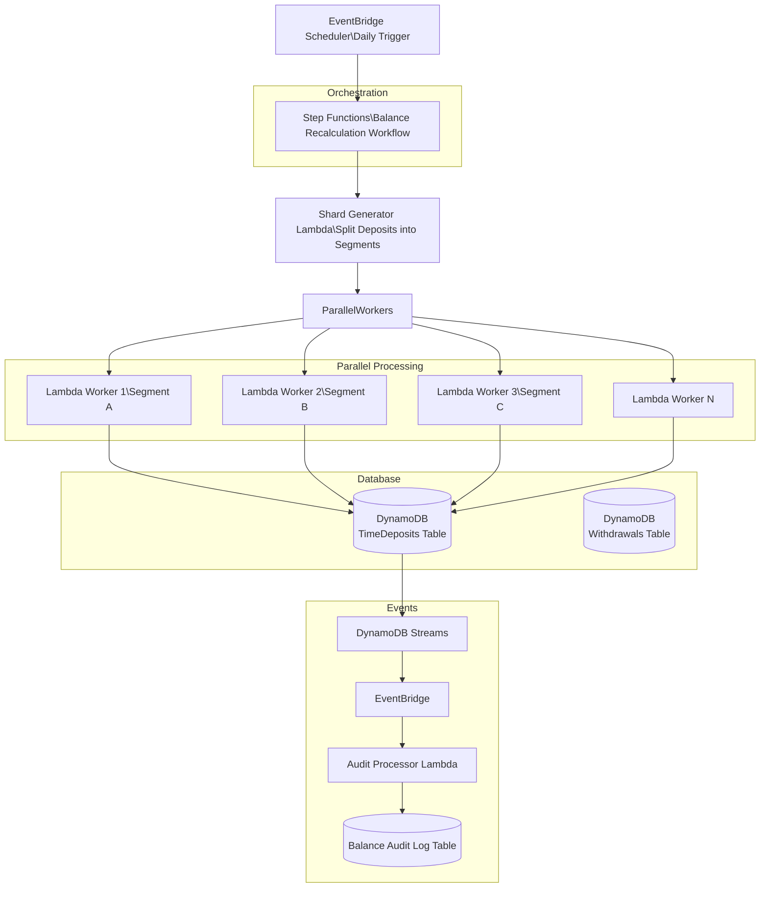
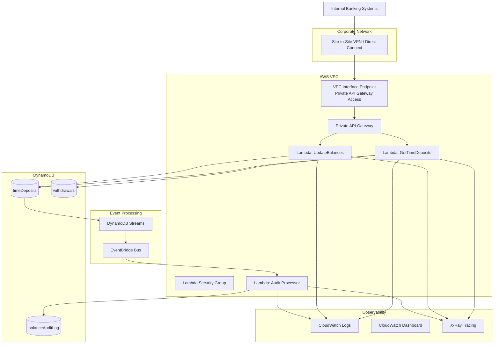

## Add idempotency protection to balance updates.

**Because if the job runs twice, then the interest could be applied twice.**

Solution: `idempotencyKey or calculationDate lock`

Example DynamoDB field: `lastInterestCalculationDate`

It prevents recalculating the same period.

## Proposed AWS Balance Recalculation at Scale (Millions of Deposits):


#### Problem statement: 

When deposits grow to millions, recalculating balances with a single Lambda becomes problematic because:

- DynamoDB scan limits
- Lambda 15-minute timeout
- cost spikes
- retry complexity

The scalable solution is distributed recalculation using Step Functions and parallel workers.



**Advantages of this architecture:**
- horizontally scalable
- safe retries
- fault isolation
- auditability
- no table scans inside one lambda


## Proposed AWS Security Enhanced Architecture:

`Client → VPN / DirectConnect → VPC → Private API Gateway → Lambda`



---

### 1. Private API Gateway

    Only reachable through:

    VPC Interface Endpoint

    No internet exposure.


### 2. Corporate Network Access
    Internal systems connect via:

    Site-to-Site VPN

    AWS Direct Connect

    Typical bank topology:

    Datacenter → DirectConnect → AWS VPC

### 3. VPC Endpoint Policy

    Controls which principals can call the API.

    Example restriction:

    only internal IAM roles

### 4. Lambda Security Groups

    Restrict outbound access.

    Best practice:

    deny internet egress

### 5. Event Driven Audit Trail

    Balance changes produce events that are critical for financial compliance:
    ```
    DynamoDB Streams
        ↓
    EventBridge
        ↓
    Audit Lambda
        ↓
    Immutable audit log
    ```

---

## Security Layers Summary:

- **Corporate VPN Layer:** restrict external access
- **Private API Gateway Layer:** internal-only API
- **VPC Endpoint Layer:** private access path
- **API Resource Policy Layer:** allow only trusted accounts
- **IAM Authorization	Layer:** authenticate callers
- **Lambda Security Groups Layer:**	network isolation
- **DynamoDB Encryption Layer:** protect financial data
- **Audit Logs Layer:**	regulatory compliance