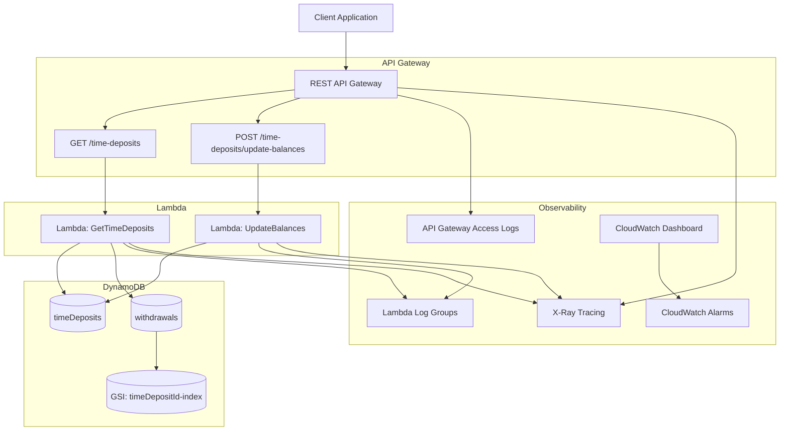

# Current AWS CDK Architecture:

## This diagram represents exactly what your CDK currently provisions.

### Components discovered in the stacks:

#### APIStack

- API Gateway
- 2 Lambdas
- Log groups
- API key + usage plan

#### DatabaseStack

- DynamoDB tables
- GSI for withdrawals

#### ObservabilityStack

- CloudWatch dashboard
- CloudWatch alarms


---
**GET /time-deposits**

Purpose:
Return deposits with withdrawal history.

Flow:
```
API Gateway
   ↓
GetTimeDeposits Lambda
   ↓
read timeDeposits
read withdrawals
   ↓
merge withdrawals by depositId
   ↓
return response
```

Response schema:
```
{
 id
 planType
 balance
 days
 withdrawals[]
}
POST /update-balances
```

Purpose:
Recalculate interest.

Flow:
```
API Gateway
   ↓
UpdateBalances Lambda
   ↓
read timeDeposits
   ↓
TimeDepositCalculator.updateBalance()
   ↓
write updated deposits
```

**Important detail: withdrawals are NOT involved.**

Interest is based only on:
```
planType
days
balance
```

Not withdrawal history.

**Lamnbda Table Access:**
```
- GetTimeDeposits Lambda only Reads timeDeposits  and Reads withdrawals

- UpdateBalances Lambda only Reads timeDeposits and Writes timeDeposits
```

**Separation of concerns:**

**Deposits table:** `state of the account`

**Withdrawals table:** `transaction history`

Only the query use case joins them.

The interest calculation stays pure domain logic.

## Improvements:

**Current state:** `UpdateBalances -> full table scan`

In production we would usually:
```
scan by partition
or
process by shards
or
trigger daily via scheduler
```