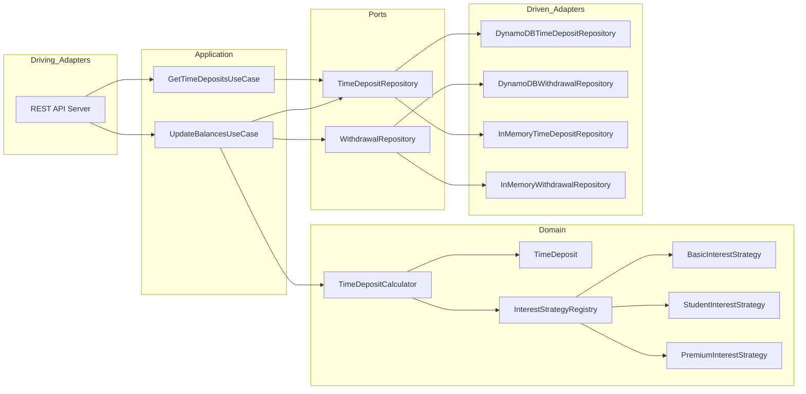

# Key takeaways:

- Domain is isolated
- Use cases orchestrate logic
- Infrastructure is replaceable
- Ports separate domain from persistence

```mermaid
flowchart LR

subgraph Driving_Adapters
API[REST API Server]
end

subgraph Application
UpdateBalances[UpdateBalancesUseCase]
GetDeposits[GetTimeDepositsUseCase]
end

subgraph Domain
Calculator[TimeDepositCalculator]
Deposit[TimeDeposit]
Registry[InterestStrategyRegistry]

Basic[BasicInterestStrategy]
Student[StudentInterestStrategy]
Premium[PremiumInterestStrategy]
end

subgraph Ports
TDRepo[TimeDepositRepository]
WithdrawalRepo[WithdrawalRepository]
end

subgraph Driven_Adapters
DynamoTD[DynamoDBTimeDepositRepository]
DynamoW[DynamoDBWithdrawalRepository]

MemTD[InMemoryTimeDepositRepository]
MemW[InMemoryWithdrawalRepository]
end

API --> UpdateBalances
API --> GetDeposits

UpdateBalances --> TDRepo
UpdateBalances --> WithdrawalRepo
UpdateBalances --> Calculator

GetDeposits --> TDRepo

Calculator --> Deposit
Calculator --> Registry

Registry --> Basic
Registry --> Student
Registry --> Premium

TDRepo --> DynamoTD
TDRepo --> MemTD

WithdrawalRepo --> DynamoW
WithdrawalRepo --> MemW
```