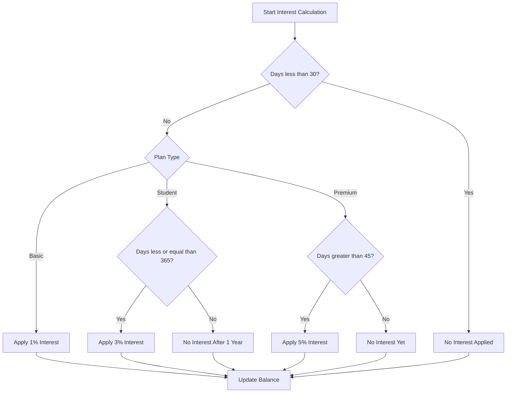

```mermaid
flowchart TD

Start[Start Interest Calculation]

Start --> CheckDays{Days less than 30?}

CheckDays -->|Yes| NoInterest[No Interest Applied]
CheckDays -->|No| PlanType{Plan Type}

PlanType -->|Basic| BasicCalc[Apply 1% Interest]

PlanType -->|Student| StudentCheck{Days less or equal than 365?}

StudentCheck -->|Yes| StudentCalc[Apply 3% Interest]
StudentCheck -->|No| StudentZero[No Interest After 1 Year]

PlanType -->|Premium| PremiumCheck{Days greater than 45?}

PremiumCheck -->|Yes| PremiumCalc[Apply 5% Interest]
PremiumCheck -->|No| PremiumZero[No Interest Yet]

BasicCalc --> End
StudentCalc --> End
StudentZero --> End
PremiumCalc --> End
PremiumZero --> End
NoInterest --> End

End[Update Balance]
```