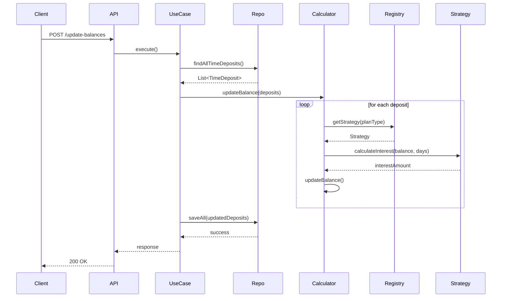

# Sequence Diagram – Update Balance Flow

This diagram shows runtime execution when the API updates balances.

This shows clearly:

- API triggers the use case
- Use case retrieves deposits
- Calculator loops deposits
- Strategy calculates interest
- Updated balances are persisted

