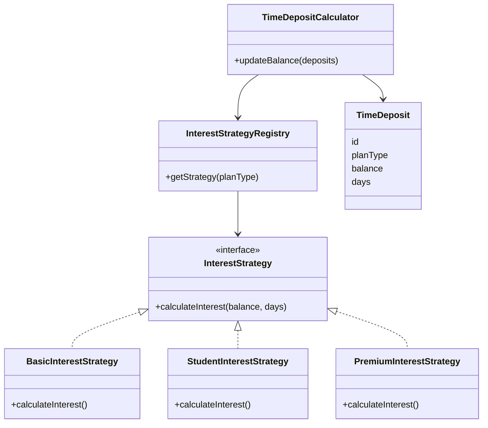

# Strategy Pattern UML Diagram

This diagram explains the interest calculation strategy design.

---

The calculator:

selects strategy → strategy calculates interest

**This satisfies the requirement:**

Design must be extensible for future complexities

Because you can simply add:

GoldInterestStrategy
CryptoInterestStrategy
VIPInterestStrategy

without modifying the calculator.